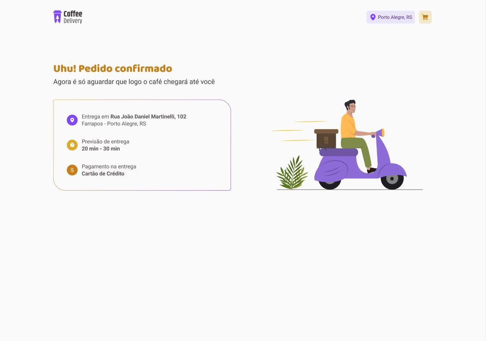

<h1 align="center">Coffee Delivery</h1>

<h2>Home</h2>

<h2>Carrinho</h2>

<h2>Pedido Confirmado</h2>

## :memo: Descrição
* Um Ecommerce de Cafés
## :books: Funcionalidades
* Uma aplicação voltada para o emommerce, com funçoes de adição ao carrinho e confirmação do pedido.
     
## :wrench: Tecnologias utilizadas
* TypeScript 
* ReactJs
* Phosphoricons
* Styled Components
* React Router Dom
* React Hook Form
* useContext
* validações com o zod

     
## :rocket: Rodando o projeto
Realize o download dos arquivos e execute o comando "npm i" para baixar a node modules dos projetos

## :handshake: Colaboradores
<table>
  <tr>
    <td align="center">
      <a href="http://github.com/oducoelho">
         
        
          <b>oducoelho</b>
        
      </a>
    </td>
  </tr>
</table>
